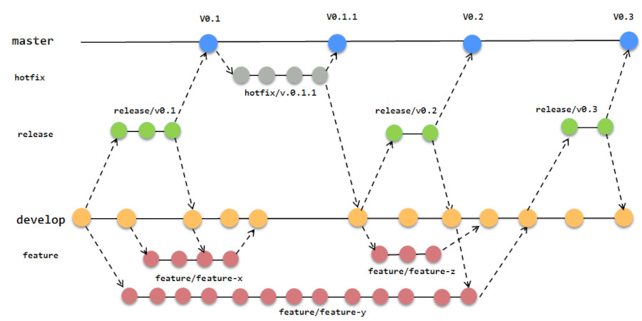

# Evaluaci-n1

Release pruebas 11-04-25 "
Se agrega Wiki para manejo del flujo de trabajo
Se prueban CI_CD según lógica deseada .



# 🔧 Procedimiento Git para Manejo de Ramas (Git Flow)

Este proyecto utiliza el modelo de ramas Git Flow. A continuación se detalla cómo crear y actualizar cada tipo de rama correctamente usando Git.

---

## 🌱 `feature/*` – Desarrollo de nuevas funcionalidades

### Crear una nueva feature:
```bash
git checkout develop
git checkout -b feature/nombre-de-la-funcionalidad
git pull origin develop
git add .
git commit -m "Feature xxxx función xxxx"
git push
git merge develop
```
## 🧪 `release/*` – Preparación para nueva versión
```bash
git checkout -b release/vX.X
git pull origin develop
# Realizas los commits necesarios
git add .
git commit -m "chore: ajustes previos a la versión vX.X"
git push
# Fusionar la release en main y develop
git checkout main
git merge release/vX.X
git checkout develop
git merge release/vX.X
git push
```

## 🛠️ hotfix/* – Corrección urgente en producción
```bash
git checkout -b hotfix/vX.X.X
git pull origin main
# Realizas los commits necesarios
git add .
git commit -m "fix: corrección crítica en producción"
git push
# Fusionar la release en main y develop
git checkout develop
git merge hotfix/vX.X.X
git checkout main
git merge hotfix/vX.X.X
```
## 📦 develop – Rama de desarrollo
```bash
# Actualizar Rama de desarrollo
git checkout develop
git pull origin develop
```
##  📌 main – Rama de producción

```bash
# Actualizar Rama de desarrollo
git checkout main
git pull origin main
```